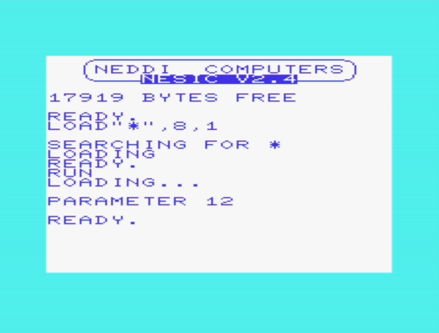

# LOADER EXAMPLE

This example demonstrates the possibility of creating a loader and passing a simple parameter (a byte) to the next block.

A byte of RAM (out of 6 available) is used beyond the end of the video area, but any available RAM location can be used.

## FIRST BLOCK: "LOADER"

```
100 BGN[LOADER]

110 PRINT "LOADING…"

120 POKE $19FA,#12

130 RUN "BLOCCO2",8
```

## SECOND BLOCK: "BLOCK2"

```
100 BGN[BLOCK2]

110 PRINT "PARAMETER";PEEK($19FA)

120 END
```

## EXECUTION:

```
RUN

LOADING...

PARAMETER 12

READY.
```


