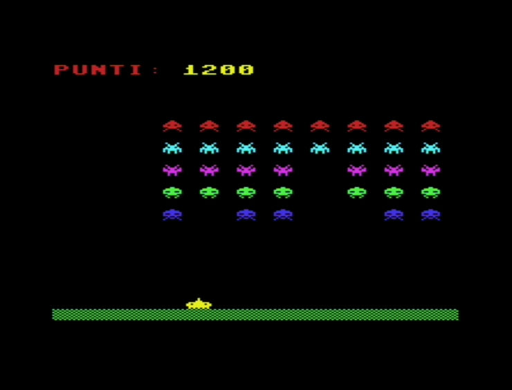
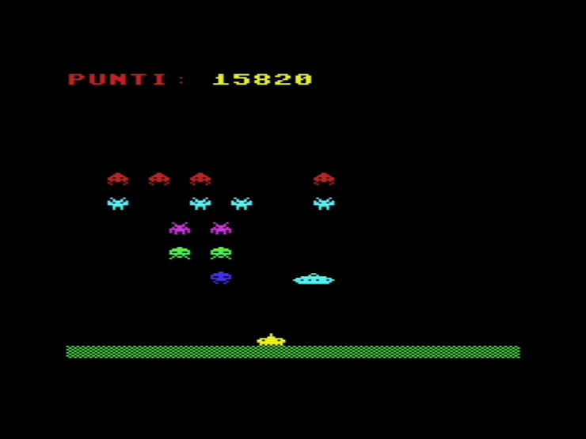

# NESIC INVADERS

  
Here are some examples of a simple video game. They represent various stages in the development of the same game:

**micro-invaders:** a first, simple example featuring a UFO and a player-controlled cannon.

**micro-invaders2:** the same setup, but with two UFOs.

**mini-invaders:** a row of aliens, a UFO, and a cannon.

**nesic-invaders:** 5 rows of aliens, a UFO, and a cannon.

This last version is the most complete one.

**Notes:** the UFOs and aliens do not fire back; the challenge lies in preventing the UFO or the aliens from reaching the ground. Only one life is available.

The examples are provided in .txt format with lowercase text to facilitate copying and pasting into VICE, as well as in .prg format.

